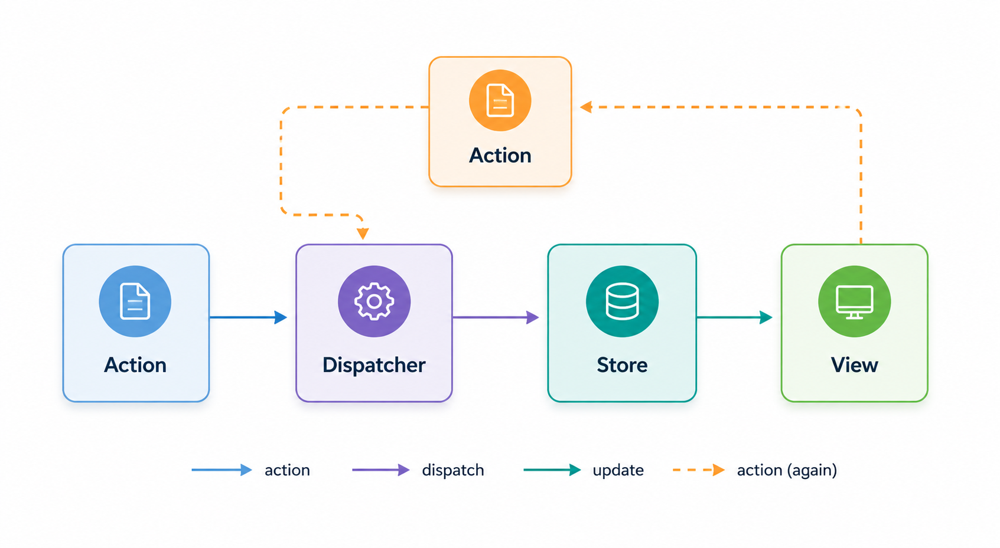

## React의 단방향 데이터 흐름: props drilling

React를 사용하다 보면 결국 “상태를 어떻게 관리할 것인가”라는 문제를 마주하게 된다.

React는 기본적으로 단방향 데이터 흐름 구조를 가진다.

즉, 부모 → 자식 방향으로만 데이터가 흐르기 때문에  
컴포넌트 구조가 깊어질수록 같은 데이터를 계속 전달해야 하는 상황이 생긴다.

```tsx
<Parent>
  <A user={user}>
    <B user={user}>
      <C user={user} />
    </B>
  </A>
</Parent>
```

간단한 구조일 경우 내부 `state`만으로 충분하다. 하지만,

- 중간 컴포넌트는 실제 사용하지 않지만 props을 계속 전달해줘야 하는 경우
- 구조가 바뀌면 props 전달 구조도 같이 수정
- 어떤 컴포넌트가 어떤 데이터를 사용하는지 추적이 어려움

이게 흔히 말하는 **props drilling** 문제다.

---

## 그래서 Context API을 사용했다.

이 문제를 해결하기 위해 React는 Context API를 제공한다.

Context API의 가장 큰 장점은,

- props drilling 문제 해결
- React 내장 기능이라 별도 라이브러리가 필요 없음

그래서 개인 프로젝트를 할 때 특별한 이유가 없으면 기본 Context API 을 사용했다.

그런데 왜 실무에서는 Context API가 아닌 다른 패키지를 설치하면서 외부 라이브러리를 사용하는 걸까?

---

### Context API의 한계

개인 프로젝트에서는 크게 불편하지 않았다.
하지만 실무에서 상태가 많아지고 컴포넌트 구조가 복잡해지면서 한계가 보였다.

```tsx
<AppContext.Provider value={{ user, theme }}>
```

이 구조에서 theme만 변경되어도
user를 사용하는 컴포넌트까지 전부 리렌더링된다.

즉, 상태와 관계없는 컴포넌트까지 렌더링 비용이 발생한다.

---

### React.memo로 리렌더링 방지하면 안되나?

> \*React.memo
> 부모 컴포넌트에서 리렌더링이 발생 하더라도 자식 컴포넌트의 props가 변경되지 않으면 자식 컴포넌트 렌더링을 건너뛰는 최적화 도구다.

그래서 단순히 React.memo만 적용하면 해결될 줄 알았다.

하지만 Context를 구독하는 순간 이야기가 달라진다.

```tsx
const Child = React.memo(() => {
  const { theme } = useContext(AppContext);

  return <GrandChild />;
});
```

이 경우 Context 값이 변경되면 Child는 다시 렌더링된다.

그리고 Child가 다시 렌더링되기 때문에 그 아래 자식 컴포넌트들도 다시 렌더링된다.

즉, Context를 구독하는 컴포넌트가 리렌더링의 시작점이 된다.

결국 Context API를 사용하면

- 필요한 상태만 선택적으로 구독하기 어렵고
- 성능 최적화를 컴포넌트마다 신경 써야 하고
- 상태 구조가 커질수록 Provider 관리도 복잡해진다

는 한계를 느끼게 됐다.

---

## 외부 전역 상태 관리 라이브러리: Redux

이 시점에서 자연스럽게 Redux, Zustand 같은 전역 상태 관리 라이브러리를 다시 보게 됐다.

이 라이브러리들의 공통점은 단순히 “전역 상태”를 제공하는 것이 아니라

- 필요한 상태만 선택적으로 구독하고
- 불필요한 리렌더링을 줄이며
- 상태 변경 흐름을 일정한 패턴으로 관리한다

는 점이었다.

이번 글에서는 내가 첫 실무에서 사용했던 Redux와
최근 다시 사용해보며 느꼈던 Redux Toolkit(RTK)에 대해 정리해보려고 한다.

---

### Redux는 Flux로부터 영감받았다

Redux는 Flux로 부터 영감 받았다.

#### Redux는 Flux 아키텍처의 단방향 데이터 흐름 개념에서 영감을 받은 라이브러리였다.

왜냐면 원래 Flux에는:

- Dispatcher
- 여러 Store

개념이 있는데 Redux는:

- 단일 Store
- reducer 기반

으로 단순화 되었다.

Redux의 상태를 변경하는 흐름은 다음과 같다.



핵심은 상태를 직접 수정하지 않는다는 점이다.

반드시 action이라는 이벤트를 통해 상태 변경 흐름이 발생한다.

---

## Context API vs Redux: 상태 흐름 추적

여기서 처음에는 이런 생각이 들었다.

> “Context도 login 함수를 만들어 상태를 변경하면 되는 거 아닌가?”

실제로 가능하다.

```tsx
const login = async () => {
  const user = await api();

  setUser(user);
};
```

그리고 Context에서 이렇게 내려줄 수도 있다.

```tsx
const { login } = useUserContext();
```

즉 Context도 충분히 상태 흐름을 관리할 수 있다.

그래서 처음에는 Redux와 큰 차이를 못 느꼈다.

### 그런데 Redux는 상태 변경 구조를 강제한다

차이는 “가능 여부”가 아니라 구조의 강제성에 있었다.

Context는 자유도가 높다.

User와 관련된 상태를 변경할 때

```
login();
logout();
refreshUser();
setUser();
```

어떤 방식이든 상태 변경이 가능하다.

반면 Redux는 상태 변경 흐름을 하나로 강제한다.

```
dispatch(login(user));
```

즉 상태 변경이 반드시:

```
dispatch
→ action
→ reducer
→ state 변경
```

흐름으로만 진행된다.

### 왜 이게 중요할까?

작은 프로젝트에서는 큰 차이가 없다.

하지만 프로젝트 규모가 커질수록

- 누가 상태를 바꾸는지
- 어디서 바뀌는지
- 어떤 이유로 바뀌는지

찾는 일이 점점 중요해진다.

Redux에서는 상태 변경 로직이 reducer에 모인다.

```tsx
dispatch({
  type: 'USER_LOGIN',
  payload: user,
});
```

그러면 결국 reducer의

```ts
case 'USER_LOGIN':
```

만 찾으면 된다.

즉 Redux는 상태 변경 흐름 자체를 일정한 패턴으로 강제하기 때문에
디버깅과 추적이 쉬워지는 구조였다.

개인적으로는 이 부분에서 "상태 흐름 추적"에 관련하여 Redux를 왜 사용하는지 이해가 됐다.

---

## Redux vs RTK: 보일러플레이트 코드

> 보일러플레이트 코드:

> 기능 자체보다 구조를 사용하기 위해 반복적으로 작성해야 하는 코드

실무에서 처음 사용했던 건 기존 Redux였다.

당시에는 이미 프로젝트가 구성되어 있었기 때문에 큰 불편함은 못 느꼈다.

하지만 지금 다시 보니 상태 하나를 추가하는 과정에서도 코드가 꽤 많았다.

### 기존 Redux 방식

보통 다음 파일들을 관리했다.

1. Action Type
2. Action Creator
3. Reducer

---

1. Action Type

```ts
// calendar.types.ts
export const SET_DATE = 'calendar/SET_DATE';
export const SET_PREV_WEEK = 'calendar/SET_PREV_WEEK';
export const SET_NEXT_WEEK = 'calendar/SET_NEXT_WEEK';
```

2. Action Creator

```ts
// calendar.actions.ts
export const setDate = (date: string) => ({
  type: SET_DATE,
  payload: date,
});

export const setPrevWeek = () => ({
  type: SET_PREV_WEEK,
});
```

3. 저장소 Store(reducer)

```ts
const initialState: CalendarState = {
  selectedDate: toLocalISOString(new Date()),
};

export const calendarReducer = (state = initialState, action: CalendarAction) => {
  switch (action.type) {
    case SET_DATE:
      return {
        ...state,
        selectedDate: action.payload,
      };

    default:
      return state;
  }
};
```

이렇게 상태 하나를 추가할 때마다 여러 파일을 수정해야 했다.

추가로 reducer에서는 불변성을 유지하기 위해 매번 새로운 객체를 반환해야 했다.

```ts
return {
  ...state,
  selectedDate: action.payload,
};
```

---

### RTK(Redux Toolkit) 방식

RTK는 `createSlice`를 통해 이 구조를 하나로 합칠 수 있었다.

```ts
export interface CalendarState {
  selectedDate: string;
}

const initialState: CalendarState = {
  selectedDate: toLocalISOString(new Date()),
};

export const calendarSlice = createSlice({
  name: 'calendar',
  initialState,
  reducers: {
    setDate: (state, action: PayloadAction<string>) => {
      state.selectedDate = action.payload;
    },
    setPrevWeek: (state) => {
      const d = new Date(state.selectedDate);
      d.setDate(d.getDate() - 7);
      state.selectedDate = d.toISOString();
    },
    setNextWeek: (state) => {
      const d = new Date(state.selectedDate);
      d.setDate(d.getDate() + 7);
      state.selectedDate = d.toISOString();
    },
  },
});
```

이것 만으로도 많은 코드양이 줄어들었다.

## RTK에서 추가된 기능

RTK는 내부적으로 많은 걸 자동화해준다.

### action type 생성

기존 Action Type 파일로 문자열로 관리됐던 파일을 자동으로 생성해준다.

```ts
name: 'calendar'
reducers: {
  setDate: ...
}
```

이렇게 작성하면 내부적으로 `calendar/setDate` 라는 action type이 자동 생성된다.

즉, 개발자가 문자열을 직접 관리할 필요가 없다.

---

### Immer 내장

기존 Redux에서는 불변성을 지키기 위해 새 객체를 반환해야 했다.

```ts
return {
  ...state,
  value: 1,
};
```

하지만 RTK는 Immer가 내장되어 있기 때문에

```ts
state.value = 1;
```

처럼 작성해도 내부적으로 불변성을 유지해준다.

---

### 비동기 처리

지금은 서버 상태 관리를 위해 tanstack query을 사용하고 있지만,
예전 Redux에서는 비동기 처리를 위해 thunk 패턴을 많이 사용했다.

### 기존 Redux 방식

```ts
export const login = (data) => {
  return async (dispatch) => {
    dispatch({ type: 'LOGIN_PENDING' });

    try {
      const response = await loginAPI(data);

      dispatch({
        type: 'LOGIN_SUCCESS',
        payload: response.data,
      });
    } catch (error) {
      dispatch({
        type: 'LOGIN_FAILURE',
        payload: error,
      });
    }
  };
};
```

그리고 reducer에서 직접 로딩 상태를 관리했다.

```ts
case 'LOGIN_PENDING':
  return {
    ...state,
    isLoading: true,
  };

case 'LOGIN_SUCCESS':
  return {
    ...state,
    isLoading: false,
    user: action.payload,
  };
```

이렇게 비동기 요청 하나마다 상태 흐름을 다 만들어야 했다.

### RTK: createAsyncThunk

RTK에서는 `createAsyncThunk`로 이 과정을 추상화했다.

```ts
const getUserInfo = createAsyncThunk('user/getUserInfo', async (token: string) => {
  const res = await getUserAPI(token);

  return res.data;
});
```

그리고 reducer에서는 이렇게 처리한다.

```ts
extraReducers: (builder) => {
  builder
    .addCase(getUserInfo.pending, (state) => {
      state.isLoading = true;
    })

    .addCase(getUserInfo.fulfilled, (state, action) => {
      state.isLoading = false;
      state.profile = action.payload;
    })

    .addCase(getUserInfo.rejected, (state) => {
      state.isLoading = false;
    });
};
```

RTK에서는 pending, fulfilled, rejected을 자동 생성해준다.

지금은 서버 상태 관리를 위해 TanStack Query를 더 많이 사용하지만
Redux thunk에 비해 RTK를 사용하면서 비동기 흐름과 로딩 상태 관리가 훨씬 명확해졌다고 느꼈다.

---

### Store 사용하는 코드

실제 사용하는 코드는 크게 다르지 않다.

```tsx
const dispatch = useDispatch<AppDispatch>();

dispatch(setDate('2026-05-06'));
dispatch(setPrevWeek());

const selectedDate = useSelector((state: RootState) => state.calendar.selectedDate);
```

## 마무리

처음에는 redux을 이렇게 생각했다.

> 프로젝트 규모가 클 수록 redux을, 그렇지 않을 경우 Context API 사용

틀린말은 아니지만 지금은 기준이 조금 달라졌다.

- props drilling 문제가 커지는 경우
- 여러 컴포넌트에서 복잡하게 상태를 공유하는 경우
- 상태 변경 흐름을 추적해야 하는 경우
- Context API의 리렌더링 한계를 줄이고 싶은 경우

반대로

- 단순 컴포넌트 상태
- 디자인 시스템 내부 상태
- 서버 상태(API 캐싱)

같은 경우에는 다른 선택지가 더 적합하다고 생각한다.

현재 내가 전역상태 관리를 사용하는 방법은 다음과 같다

- 디자인 시스템과 같이 컴포넌트 내에서만 사용될 때: Context API
- 서버 상태관리: Tanstack Query
- 복잡한 상태 흐름: Redux, zustands

그리고 Redux를 사용한다면
지금은 기존 Redux보다 RTK를 우선 고려하게 된다.
