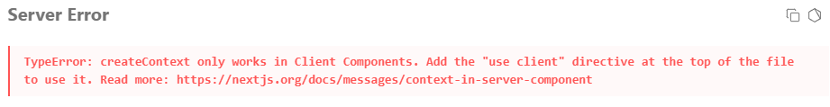

## styled-components 사용하게 된 이유

처음 React를 사용했을 때는 순수 CSS를 사용했다.

하지만 프로젝트 규모가 커질수록 불편한 점이 많아졌다.

- className을 문자열로 관리해야 하고
- JS와 CSS 파일이 분리되어 있고
- 오타가 나도 IDE가 잡아주지 못했다

그래서 자연스럽게 SCSS를 도입했다.

SCSS를 사용하면서는 꽤 만족했다.

mixin, include, 중첩 스타일링 덕분에 스타일 재사용성이 좋아졌고, 코드도 훨씬 읽기 편해졌다.

하지만 여전히 아쉬운 부분이 있었다.

- JS와 CSS가 분리되어 있다는 점
- 문자열 기반 className 관리
- 컴포넌트 단위 추상화의 한계

그러다 styled-components를 사용하게 됐다.

```tsx
const Wrapper = styled.div`
  display: flex;
`;
```

처음에는 이 방식이 가장 React스럽다고 생각했다.

- 컴포넌트 단위 스타일링
- props 기반 동적 스타일링
- JS 안에서 스타일 관리

특히 React 컴포넌트와 스타일이 같이 존재하는 구조가 꽤 직관적으로 느껴졌다.

하지만 Next.js App Router를 사용하면서 생각이 조금 바뀌기 시작했다.

---

## 서버 컴포넌트에서의 제약

Next.js에서 Styled-components을 처음 사용할 때 다음 화면을 마주했을 것이다.



Next.js App Router에서는 기본적으로 서버 컴포넌트가 사용된다.

하지만 styled-components는 내부적으로 Context API를 사용하기 때문에 클라이언트 컴포넌트 환경이 필요하다.

결국 styled-components를 사용하는 컴포넌트는 use client가 필요했다.

물론 styled-components 자체가 나쁜 선택이라는 뜻은 아니며 컴포넌트를 분리해 사용 할 수 있다.

그리고, CSR 중심 프로젝트에서는 여전히 생산성이 높고, props 기반 동적 스타일링도 매우 강력하다.

다만 내가 Next.js App Router 기반에서 서버 컴포넌트를 적극 활용하려다 보니 조금씩 구조적인 제약이 보이기 시작했다.

추가로 Next.js 환경에서는 설정도 필요했다.

- next.config.js 설정
- StyledComponentsRegistry 등록

공식문서에서도 App Router 환경에서는 별도 registry 설정이 필요하다고 설명한다.

개인적으로는 이 시점부터 이런 생각이 들었다.

> 서버 컴포넌트와 잘 맞는 스타일링 라이브러리가 없을까?

그러다 보게 된 게 vanilla-extract/css였다.

---

## vanilla-extract/css

### Zero-runtime CSS

처음 vanilla-extract를 봤을 때 가장 많이 보이던 키워드가 있었다.

> Zero-runtime CSS

처음에는 솔직히 크게 와닿지 않았다.

그런데 구조를 이해하고 나니 왜 강조하는지 알게 됐다.

styled-components는 런타임에서 CSS를 생성한다.

반면 vanilla-extract는 빌드 시점에 CSS 파일을 미리 생성한다.

즉,

- 런타임 CSS 생성 비용이 없고
- JS 번들에 스타일 생성 로직이 포함되지 않으며
- 서버 컴포넌트에서도 안전하게 사용할 수 있다

이걸 보고 내가 이해한 기준은 이거였다.

> “JS처럼 작성하지만 결과는 정적인 CSS 파일로 만드는 방식이다.”

개인적으로는 이 지점이 가장 매력적으로 느껴졌다.

### 재사용 구조

SCSS는 mixin, styled-components는 모듈처럼 관리가 가능하다.
vanilla-extract 또한 스타일을 모듈처럼 관리가 가능했다.

```ts
export const flex = style({
  display: 'flex',
});

export const columnFlex = style([
  flex,
  {
    flexDirection: 'column',
  },
]);
```

## Sprinkles: tailwindcss의 장점과 타입 안정성

사실 처음에는 이런 의문이 들었다.

> “styled-components도 TypeScript로 타입 지정 가능한데,
> 왜 vanilla-extract만 CSS-in-TS라고 하지?”

실제로 styled-components도 충분히 타입 안전하게 만들 수 있다.

```tsx
const Button = styled.button<{
  bg: keyof typeof colors;
}>`
  background: ${({ bg }) => colors[bg]};
`;
```

이렇게 하면 허용한 디자인 토큰만 사용할 수 있고,
잘못된 값은 컴파일 단계에서 막을 수 있다.

그래서 처음에는 둘의 차이를 잘 이해하지 못했다.

내가 느낀 차이는
“스타일 생성 시점”과
“타입 적용 범위”에 가까웠다.

styled-components는
props 타입을 기반으로 스타일을 런타임에서 생성한다.

반면 vanilla-extract는
스타일 정의 자체를 TypeScript 객체 기반으로 만들고,
빌드 시 정적인 CSS를 생성한다.

## Recipe: 디자인 시스템에 적용하기

디자인 시스템 기반 Button을 만들다 보니 문제가 생겼다.

- variants: filled | elevate | outlined | tonal
- size: sm | md | lg

각 디자인 토큰별 다른 스타일링이 적용되어야 했다.

### 스타일 조합을 구조적으로 관리하기

recipe는 크게 4가지 속성을 가진다.

- base
- variants
- compoundVariants
- defaultVariants

### base

```ts
base: [
  {
    cursor: 'pointer',
    display: 'flex',
    justifyContent: 'center',
    alignItems: 'center',
  },
],
```

base는 말 그대로 공통 스타일이다.

버튼 타입과 관계없이 항상 들어가야 하는 스타일을 정의한다.

### variants

```ts
variants: {
  type: {
    filled: [],
    outlined: [],
    tonal: [],
  },
},
```

variants는 스타일의 상태 조합을 정의한다.

예를 들어 Button 타입을 props 기반으로 바꾸고 싶다면 이렇게 사용할 수 있다.

```tsx
<Button variants="filled" />
<Button variants="outlined" />
```

처음에는 단순 스타일 분기 정도로 생각했는데, 실제로는 “컴포넌트 상태를 타입 기반으로 관리하는 구조”에 가까웠다.

### defaultVariants

variants에서 정의한 기본 값을 정의한다.

```ts
defaultVariants: {
  size: 'sm',
  shape: 'round',
  variants: 'filled',
},
```

결국

```tsx
<Button />
```

이렇게만 사용해도 기본 디자인 규칙을 유지할 수 있다.

- 디자인 시스템의 기본 상태를 강제하고
- 반복 props를 줄이며
- 일관된 UI를 유지할 수 있었다.

### compoundVariants

compoundVariants는 이런 “특정 조합에서만 필요한 스타일”을 구조적으로 관리할 수 있었다.

예를 들어:

- round shape
- sm size

조합에서는 radius가 달라야 했다.

```ts
{
  variants: { shape: 'round', size: 'sm' },
  style: {
    borderRadius: staticVars.shape.corner.full,
  },
}
```

### RecipeVarianst

처음에는 variants 타입도 직접 선언하려 했다.

```ts
variants: 'filled' | 'outlined' | 'text';
```

하지만, 직접 선언할 경우 오타에 대한 실수와 새로운 variants가 추가될 때 마다
두개의 파일의 수정이 필요했다.

그런데 RecipeVariants를 사용하면 recipe에 정의한 variants 기준으로 타입이 자동 추론된다.

```ts
export type Md3ButtonStyleProps = Required<NonNullable<RecipeVariants<typeof md3Button>>>;
```

Required, NonNullable 유틸 타입을 사용한 이유는
RecipeVariants는 optional 기반 타입으로 생성된다.
즉,

```ts
variants?: 'filled' | 'outlined';
```

이런 형태가 된다.

props가 명확하게 드러나야 하기 때문에 유틸타입을 추가해 주었다.

## 마무리

그러나 vanilla-extract가 항상 정답이라고 생각되진 않는다
build 타입에 정적인 css을 생성해야하니 build 시간은 더 오래걸릴것이라 생각되고
vanilla-extract도 동적 스타일링에 대한 대응은 가능하다
내가 개인적으로 생각하는 단점으로는

- css selectors인 중첩 스타일링에 복잡
- 동적 스타일링도 복잡
  이었다

결국 이 글을 통해 내 기준은 다음과 같이 판단한다

- 서버 컴포넌트를 적극 활용
- 런타임 비용 최적화
- 디자인 시스템 중심 구조인지

다음 글에서는 실제로 사용하며 가장 헷갈렸던 부분인

- createVar
- assignInlineVars
- css Selector
- createTheme
  등 동적 스타일링과 테마 구조에 대해 정리해 보려 한다.

## REf

- [vanilla-extract/css 공식문서](https://vanilla-extract.style/documentation/getting-started)
- [styled-components 공식문서](https://styled-components.com/docs/advanced#server-side-rendering)
