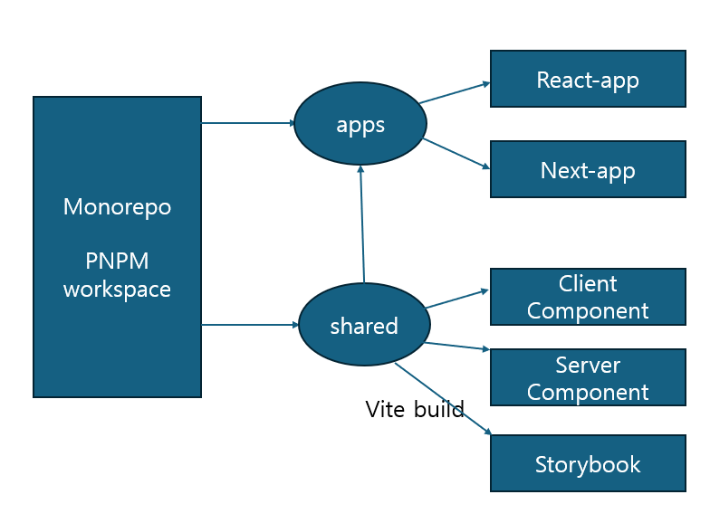

## 모노레포라는 단어를 들어본 적이 있으신가요?

아마 적지 않은 개발자분들이 한 번쯤은 들어보셨을 거라고 생각합니다.

저는 처음 SI 회사에 입사했을 때 이 단어를 마주했습니다.  
그전까지는 프로젝트 하나당 하나의 repository를 생성하는 방식이 익숙했습니다.

새 프로젝트를 시작할 때면 항상 아래와 같이 시작했습니다.

```bash
npx create-react-app
```

혹은

```bash
npx create-next-app
```

그리고 프로젝트마다 반복했습니다.

- eslint 설정
- prettier 설정
- tsconfig 설정
- 공통 컴포넌트 작성

~~eslint, tsconfig는 있는걸 그대로 사용했어요..~~

Button, Input 같은 컴포넌트도 결국 비슷한 형태로 다시 만들고 있었습니다.

모노레포를 알기 전까지는요!

---

## 내가 처음 이해한 모노레포

구조는 간단했습니다.

```text
apps/
packages/
```

`apps`에는 실제 서비스 프로젝트가 있었고,  
`packages`에는 여러 프로젝트에서 함께 사용하는 UI 컴포넌트, 유틸 함수, 설정들이 존재했습니다.

처음에는 단순히

> “공통 코드를 한 곳에 모아두는 구조구나”

정도로 이해했습니다.

하지만 실제로 개발하다 보니 생각이 조금 바뀌었습니다.

제가 느낀 모노레포는 단순히 repository를 하나로 합치는 개념이 아니었습니다.

개인적으로는 이렇게 이해하게 됐습니다.

> **여러 프로젝트가 공통된 코드와 개발 규칙을 함께 공유하기 위한 구조**

예를 들면 이런 것들입니다.

- 공통 UI 컴포넌트
- 유틸 함수
- eslint / prettier 규칙
- tsconfig 설정

특히 개인 프로젝트를 만들 때마다 반복했던 설정 비용을 줄일 수 있다는 점이 꽤 크게 와닿았습니다.

그리고 그 시작이 바로 `pnpm workspace` 였습니다.

---

## 왜 pnpm workspace를 선택했을까?

사실 가장 큰 이유는 회사에서 이미 사용하고 있었기 때문이었습니다.

회사에서도 `pnpm workspace` 기반 모노레포 구조를 사용하고 있었고,  
실무에서 사용하는 방식을 직접 경험해보며 익숙해지고 싶었습니다.

하지만 조사해 보니 생각보다 장점이 명확했습니다.

### 1. pnpm 패키지 매니저의 패키지 관리 방식

pnpm 패키지 매니저는 패키지 관리를 위해 `Symlink(Symbolic Link, 심볼릭 링크)`을 사용합니다.

이를 통해 **디스크 공간 절약 + 같은 패키지 재사용** 합니다.

예를 들어 모노레포 안에서 여러 프로젝트가 모두 `react`를 사용한다고 가정해봅시다.

기존 방식이라면 프로젝트마다 패키지를 각각 설치하게됩니다.

```text
app-a/node_modules/react
app-b/node_modules/react
app-c/node_modules/react
```

하지만 `pnpm`은 조금 다르게 동작합니다.

실제 패키지는 루트 저장소에 한 번만 저장하고,

```text
node_modules/.pnpm
```

각 프로젝트는 그 패키지를 바라보는 방식이었습니다.

```text
app-a → react
app-b → react
app-c → react
```

처음엔 조금 신기했습니다.

> “같은 패키지를 굳이 여러 번 복사하지 않는구나”

덕분에 디스크 낭비를 줄일 수 있었고,  
모노레포 환경에서도 비교적 가볍게 관리할 수 있었습니다.

### 2. 설정 난이도가 생각보다 낮았다

`pnpm workspace`는 설정은 단순했습니다.

```yaml
# pnpm-workspace.yaml
packages:
  - 'apps/*'
  - 'packages/*'
```

이 정도 설정만으로 workspace 패키지로 인식됩니다.

그리고 내부 패키지도 바로 연결할 수 있었습니다.

```json
{
  "dependencies": {
    "@repo/ui": "workspace:*"
  }
}
```

개인적으로는 이 부분에서 꽤 진입장벽이 낮다고 느꼈습니다.

> “생각보다 바로 시작할 수 있네?”

라는 느낌이었습니다.

그렇게 `pnpm workspace` 기반 모노레포를 시작하게 됐습니다.

하지만 실제 개발은 생각보다 순탄하지 않았습니다.

## 모노레포 구조

제가 만들고 싶었던 구조는 단순했습니다.



```text
apps/
 ├─ react-app
 └─ next-app

packages/
 ├─ ui
 ├─ storybook
 └─ configs
```

- `apps` → 실제 배포 프로젝트
- `shared` → 공통 UI, 유틸, 설정

그리고 `packages/shared`에서 만든 Button을 여러 프로젝트에서 재사용하는 구조였습니다.

```tsx
import { Button } from '@repo/ui';
```

처음에는 꽤 만족스러웠습니다.

“이제 Button을 프로젝트마다 복사 붙여넣기 하지 않아도 되겠네”

싶었습니다.

하지만 문제는 실제 개발을 시작하면서 발생했습니다.

---

## 첫 번째 문제: 공통 컴포넌트를 수정해도 바로 반영되지 않았다

처음에는 이렇게 생각했습니다.

> “workspace로 연결했으니까 수정하면 자동으로 반영되겠지?”

하지만 실제로는 아니었습니다.

제가 구성한 구조에서는 `packages/shared`가 하나의 라이브러리처럼 동작했습니다.

즉,

```text
packages/shared(src)
→ build
→ apps/react-app 사용
```

이런 흐름이었습니다.

그래서 Button을 수정하면

```tsx
// packages/ui/Button.tsx
const Button = () => {
  return <button>New Button</button>;
};
```

앱에서 바로 보이지 않았습니다.

매번 build를 다시 해야 했습니다.

```bash
pnpm build
```

```text
수정
→ build
→ 앱 확인
→ 다시 수정
→ build
```

이 과정이 반복됐습니다.

생각보다 꽤 불편했습니다.

그때 처음 이런 고민을 하게 됐습니다.

> “build 없이 바로 개발할 수는 없을까?”

---

## 해결 방법 1. source를 직접 바라보게 만들기

제가 사용하던 공통 컴포넌트 패키지는 `vite`로 구성했습니다.

처음에는 단순히 build 도구라고만 생각했습니다.

하지만 실제로는 Vite의 강점이 **빠른 개발 경험(HMR)** 에 있다는 걸 나중에서야 이해하게 됐습니다.

그래서 앱이 build 결과물이 아니라 source 자체를 바라보게 바꿨습니다.

```ts
// vite.config.ts
resolve: {
  alias: {
    "@repo/ui": path.resolve(
      __dirname,
      "../../packages/ui/src"
    )
  }
}
```

이렇게 설정하니 흐름이 달라졌습니다.

```text
기존
apps → packages/ui/dist

변경 후
apps → packages/ui/src
```

그 결과 수정사항이 바로 반영됐습니다.

---

## 두 번째 문제: 바깥 프로젝트를 직접 바라보면 발생하는 TS 문제

공통 컴포넌트를 수정하면 바로 반영되도록 Vite 설정을 마쳤는데,  
곧바로 TypeScript 에러를 만나게 됐습니다.

```text
is not listed within the file list of project
```

처음에는 이해가 잘 되지 않았습니다.

> “경로도 맞고 import도 되는데 왜 에러가 나는 거지?”

Vite는 런타임에서 경로를 이해하고 코드를 실행하는 문제였고,

TypeScript는 “이 프로젝트가 어떤 프로젝트에 의존하는가?”

를 별도로 이해해야 했습니다.

즉, 코드는 실행되는데 TypeScript는 아직 프로젝트 관계를 모르는 상태였습니다.

---

## 해결 방법 2. tsconfig references

처음에는 import 경로만 맞으면 TypeScript도 알아서 이해할 거라고 생각했습니다.

하지만 실제로는 아니었습니다.

먼저 `@monorepo-pnpm/shared/client` 같은 경로를 사용하려면 TypeScript가 해당 경로를 이해해야 했습니다.

그래서 루트 `tsconfig.base.json`에 `paths`를 추가했습니다.

```json
{
  "compilerOptions": {
    "paths": {
      "@monorepo-pnpm/shared/client": ["packages/shared/src/client"],
      "@monorepo-pnpm/shared/server": ["packages/shared/src/server"]
    }
  }
}
```

그리고 Vite에서는 `vite-tsconfig-paths()` 플러그인을 통해 이 설정을 읽도록 했습니다.

덕분에 앱에서 다음과 같이 import 할 수 있었습니다.

```tsx
import { Button } from '@monorepo-pnpm/shared/client';
```

하지만 여기서 끝이 아니었습니다.

shared의 source를 직접 바라보게 만들자 이번에는 TypeScript가

> “이 파일 app 프로젝트 바깥에 있는데?”

라고 판단하며 에러를 발생시켰습니다.

```text
is not listed within the file list of project
```

이 문제를 해결하기 위해 `composite`와 `references` 설정을 추가했습니다.

먼저 shared 프로젝트를 다른 프로젝트에서 참조 가능한 상태로 만들었습니다.

```json
// tsconfig.base.json
{
  "compilerOptions": {
    "composite": true
  }
}
```

그리고 apps 프로젝트에서는 shared 프로젝트에 의존한다는 것을 명시했습니다.

```json
{
  "references": [
    {
      "path": "../../packages/shared"
    }
  ]
}
```

나중에 정리해보니 각각 역할이 달랐습니다.

```text
paths
→ TypeScript가 import 경로를 이해하게 만든다

composite
→ shared 프로젝트가 Project Reference 대상이 될 수 있게 만든다

references
→ app 프로젝트가 shared 프로젝트에 의존한다는 것을 TypeScript에게 알려준다
```

---

## 세 번째 문제: Next.js에서 서버/클라이언트 컴포넌트 충돌

다음 문제는 `Next.js`에서 발생했습니다.

처음에는 Typography처럼 서버 컴포넌트에서도 사용할 수 있는 컴포넌트를 만들었습니다.

그리고 단순히 이렇게 export 했습니다.

```ts
export * from './Typography';
export * from './Button';
```

그런데 문제가 생겼습니다.

`Button`은 `use client`가 필요한 컴포넌트였고,  
Typography는 서버에서도 사용 가능해야 했습니다.

하지만 실제 import 시에는 같은 entry를 바라보고 있었습니다.

```tsx
import { Typography } from '@repo/ui';
```

그 결과 서버 컴포넌트에서도 클라이언트 경계가 섞이며 에러가 발생했습니다.

처음에는

> “use client만 붙이면 되는 거 아닌가?”

라고 생각했습니다.

하지만 실제로는 아니었습니다.

---

## 해결 방법 3. server/client export 분리

제가 선택한 방법은 명확했습니다.

아예 entry를 분리했습니다.

```text
@repo/ui/server
@repo/ui/client
```

vite build도 나눴습니다.

```ts
lib: {
  entry: {
    client: "src/client/index.ts",
    server: "src/server/index.ts"
  }
}
```

그리고 package exports도 분리했습니다.

```json
"exports": {
  "./server": {
    "import": "./dist/server.mjs"
  },
  "./client": {
    "import": "./dist/client.mjs"
  }
}
```

덕분에 서버 컴포넌트는 서버 전용 컴포넌트만 가져오고,

```tsx
import { Typography } from '@repo/ui/server';
```

클라이언트 컴포넌트는 별도로 사용할 수 있게 됐습니다.

```tsx
import { Button } from '@repo/ui/client';
```

---

## pnpm workspace의 아쉬운 점

결론부터 말하면 `pnpm workspace`만으로도 충분히 모노레포를 구성할 수 있었습니다.

개인적으로 느낀 장점은 명확했습니다.

- 학습 곡선이 낮음
- 디스크 공간 절약
- 설정이 비교적 단순함

특히 설정 난이도가 생각보다 높지 않았습니다.

```yaml
packages:
  - 'apps/*'
  - 'packages/*'
```

이 정도 설정만으로 workspace를 구성할 수 있다는 점은 꽤 인상 깊었습니다.

하지만 실제 프로젝트를 운영하다 제가 설정한 방식으로는 아쉬운 점도 보이기 시작했습니다.

### 1. 빌드 실행 흐름이 점점 번거로워졌다

처음에는 크게 문제되지 않았습니다.

프로젝트 수가 적었기 때문입니다.

하지만 shared 패키지가 늘어나고 앱 프로젝트가 많아질수록 불편함이 생겼습니다.

예를 들어 `shared`를 수정했다면,

```text
shared build
→ app 실행
```

같은 흐름을 직접 관리해야 했습니다.

`pnpm workspace`는 패키지 연결에는 강했지만,

> 어떤 프로젝트를 먼저 build 해야 하는지
> 변경된 프로젝트만 다시 build 해야 하는지

같은 빌드 최적화까지 담당해주진 않았습니다.

프로젝트가 커질수록 빌드 속도와 실행 흐름이 점점 신경 쓰이기 시작했습니다.

---

### 2. source 직접 참조를 위한 설정 비용

공통 컴포넌트를 수정하면 바로 반영되게 만들고 싶었습니다.

그래서 `vite-tsconfig-paths`, `paths`, `references`, `composite` 같은 설정을 추가하며 source 직접 참조 방식을 구성했습니다.

덕분에 DX는 좋아졌습니다.

코드를 수정하면 바로 앱에서 확인할 수 있었기 때문입니다.

하지만 한편으로는 이런 생각도 들었습니다.

> “프로젝트가 늘어날수록 이 설정도 계속 관리해야 하는 거 아닌가?”

특히 프로젝트가 추가될 때마다 `references` 설정을 추가해야 하는 점이 조금 번거롭게 느껴졌습니다.

---

## 그래서 결국 보게 된 게 Turborepo였다

이 문제를 해결할 방법을 찾다가 `Turborepo + tsup`을 보게 됐습니다.

- 빌드 캐싱
- 변경된 프로젝트만 실행
- dependency graph 기반 pipeline 실행
- workspace task orchestration

`tsup --watch`를 함께 사용하면 source 직접 참조가 아니라,

```text
source 수정
→ dist 자동 갱신
→ 앱 반영
```

방식으로 개발할 수 있었습니다.

개인적으로는

> “굳이 source를 직접 참조하지 않아도 되겠는데?”

라는 생각이 들었습니다.

즉, 지금까지 해결하려고 했던 문제를 다른 방식으로 접근할 수 있다는 걸 알게 됐습니다.

다음 글에서는

> 왜 결국 `Turborepo + tsup` 조합을 선택하게 되었는지

그리고 `pnpm workspace`와 무엇이 달랐는지 정리해보려고 합니다.

## REF

- [PNPM으로 모노레포 구축하기](https://velog.io/@younyikim/Pnpm%EC%9C%BC%EB%A1%9C-Monorepo-%EA%B5%AC%EC%B6%95%ED%95%98%EA%B8%B0-2.-%ED%94%84%EB%A1%9C%EC%A0%9D%ED%8A%B8-%EA%B5%AC%EC%B6%95Vite-React-TypeScript)
- [How does pnpm work?](https://blog.logrocket.com/managing-full-stack-monorepo-pnpm/#sharing-types-typescript)
- [React Monorepo Setup Tutorial with pnpm and Vite: React project + UI, Utils](https://dev.to/lico/react-monorepo-setup-tutorial-with-pnpm-and-vite-react-project-ui-utils-5705)
- [2. Ghost Dependency와의 끈질긴 싸움](https://engineering.ab180.co/stories/yarn-to-pnpm)
