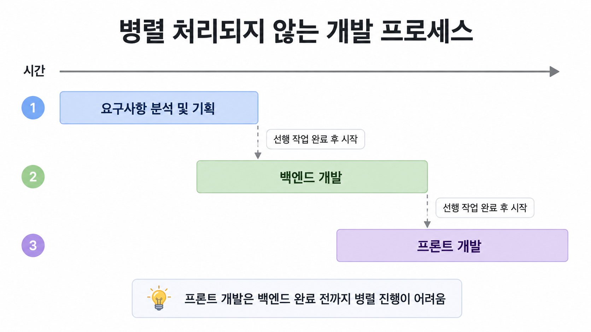

간단한 프로젝트를 시작할 때도 보통 흐름은 비슷합니다.



1. 요구사항을 정리하고
2. 백엔드에서 API를 만들고
3. 그다음 프론트엔드가 Swagger 혹은 API 명세서를 확인하며 협업하여 API를 연결합니다.

처음에는 이 흐름이 당연하다고 생각했습니다. API가 있어야 데이터를 가져올 수 있고, 응답 형태를 알아야 화면도 만들 수 있다고 봤기 때문입니다.

하지만 실제로 개발하다 보니 백엔드에서 API를 만들 때까지의 대기 시간이 적지 않았습니다. 프론트엔드 개발자는 화면 구조, 로딩 상태, 에러 상태, 빈 데이터 상태를 먼저 구현할 수 있는데도 실제 API가 없다는 이유로 작업이 뒤로 밀리는 경우가 있었습니다.

그래서 API가 아직 나오지 않았을 때 프론트엔드 개발을 어떻게 시작할 수 있을지 다시 생각하게 됐습니다.

## API가 없을 때 처음 했던 방식

처음에는 API 호출 함수 안에서 직접 더미 데이터를 반환했습니다.

로딩 상태를 확인하고 싶으면 setTimeout을 넣었고, 에러 상태를 확인하고 싶으면 일부러 reject를 발생시켰습니다.

```tsx
const fetchUsers = () =>
  new Promise<{ id: number; name: string }[]>((resolve) => {
    setTimeout(() => {
      resolve([
        { id: 1, name: 'Alice' },
        { id: 2, name: 'Bob' },
      ]);
    }, 1000);
  });

const fetchWithError = () =>
  new Promise((_, reject) => {
    setTimeout(() => {
      reject(new Error('API 에러가 발생했습니다!'));
    }, 1000);
  });
```

하지만 실제로 코드를 작성하다 보니 불편한 점이 생겼습니다.

```tsx
export async function getUsers() {
  // TODO: 실제 API 연결 시 제거해야 함
  return new Promise<User[]>((resolve) => {
    setTimeout(() => {
      resolve([
        { id: 1, name: 'Alice' },
        { id: 2, name: 'Bob' },
      ]);
    }, 1000);
  });

  // 나중에 실제 API가 나오면 이 코드로 교체해야 함
  // const res = await fetch('/api/users');
  // return res.json();
}
```

이렇게 작성한 Mock 코드는 실제 API가 개발되었을 때 다시 수정하거나 삭제해야 합니다. 문제는 이 작업이 생각보다 번거롭다는 점이었습니다.

그리고 실수로 Mock 코드가 남아 있으면 불필요한 코드가 번들에 포함될 수 있고, 의도하지 않은 응답값이 화면에 사용될 수도 있습니다.

개인적으로는 이 지점에서 MSW가 왜 필요한지 이해가 됐습니다.

## MSW 란?

제가 이해한 MSW는 **애플리케이션의 API 호출 코드는 그대로 두고, 네트워크 요청 단계에서 응답만 가로채는 도구​**입니다.

즉, 프론트엔드 코드는 실제 API를 호출하는 것처럼 작성합니다.

```tsx
export async function getUsers() {
  const res = await fetch('/api/users');

  if (!res.ok) {
    throw new Error('사용자 목록 조회 실패');
  }

  return res.json();
}
```

그리고 MSW handler에서 이 요청에 대한 응답만 정의합니다.

```tsx
import { http, HttpResponse, delay } from 'msw';

export const handlers = [
  http.get('/api/users', async () => {
    await delay(1000);

    return HttpResponse.json([
      { id: 1, name: 'Alice' },
      { id: 2, name: 'Bob' },
    ]);
  }),
];
```

MSW 공식 문서에서도 setupWorker는 브라우저 환경의 요청을 가로채기 위한 API이고, setupServer는 Node.js 프로세스에서 요청 인터셉트를 설정하는 API라고 설명합니다. 특히 setupServer는 이름에 server가 들어가지만 실제 서버를 띄우는 것이 아니라 Node.js 프로세스 안에서 요청을 가로채도록 설정하는 방식입니다.

**여기서 중요한 점은 API 호출 코드 자체가 Mock 전용 코드로 오염되지 않는다는 점입니다.**

## API가 나오기 전에도 병렬로 개발하기

MSW를 쓰게 된 가장 큰 이유는 개발 순서 때문이었습니다.

기존에는 이런 식으로 생각했습니다.

```
요구사항 분석 및 기획
↓
백엔드 API 개발
↓
프론트엔드 API 연결
↓
로딩 / 에러 / 빈 상태 처리
```

하지만 실제 프로젝트에서는 이 흐름이 항상 효율적이지 않았습니다.

프론트엔드 개발자가 API가 완성될 때까지 기다리면, 화면 개발과 상태 처리 작업이 뒤로 밀립니다. 특히 로딩, 에러, 빈 데이터, 권한 없음 같은 상태는 API가 완성된 뒤에야 급하게 붙이게 되는 경우도 있습니다.

MSW를 사용하면 흐름을 이렇게 바꿀 수 있습니다.

```
요구사항 분석 및 기획
↓
API 스펙 협의
↓
백엔드 개발 ───────────────┐
│
프론트엔드 Mock 기반 개발 ──┘
↓
실제 API 연결
```

여기서 핵심은 백엔드 없이 프론트엔드가 마음대로 개발한다 가 아니라,
API 스펙을 기준으로 프론트엔드와 백엔드가 병렬로 움직일 수 있게 만드는 것입니다.

그래서 저는 MSW를 단순히 테스트 도구라기보다, 프론트엔드 개발의 대기 시간을 줄이는 도구로 보게 됐습니다.

## Next.js App Router 에서 MSW 도입하기

이제 실제로 Next.js App Router에서 MSW를 세팅해보겠습니다.

- Next.js v16 App Router
- MSW v2.\*

제가 사용한 환경은 Next.js App Router입니다. Next.js는 Server Component와 Client Component를 함께 사용하기 때문에 MSW도 서버 요청과 브라우저 요청을 나눠서 준비해야 합니다.

Server Component의 fetch
→ Node.js 환경
→ msw/node의 setupServer 필요

Client Component의 fetch
→ Browser 환경
→ msw/browser의 setupWorker 필요

처음에는 setupWorker만 등록하면 모든 요청이 가로채질 것이라고 생각했습니다. 하지만 실제로는 그렇지 않았습니다.

브라우저에서 발생한 요청은 Service Worker가 가로챌 수 있지만, Server Component에서 실행되는 fetch는 브라우저가 아니라 서버 런타임에서 실행됩니다. 따라서 서버에서 발생한 요청은 setupServer가 같은 Node.js 런타임 안에서 먼저 실행되어 있어야 합니다.

### 1. MSW 설치 및 초기 셋팅 실행

```bash
pnpm add -D msw
npx msw init public/ --save
```

이 명령어를 실행하면 브라우저 환경에서 사용할 Mock Service Worker 파일이 public 폴더에 생성됩니다.

그다음 MSW를 개발 환경에서만 실행하기 위해 환경변수를 추가했습니다.

```json
// /.env.development
NEXT_PUBLIC_ENABLE_MSW_MOCK=true
NEXT_PUBLIC_API_BASE_URL=http://localhost:3000
```

저는 개발 모드에서만 MSW를 사용하고 싶었기 때문에 `.env.development`에 설정했습니다.

여기서 NEXT_PUBLIC_ENABLE_MSW_MOCK은 MSW 실행 여부를 제어하기 위한 값이고, NEXT_PUBLIC_API_BASE_URL은 handler에서 요청 URL을 맞추기 위해 사용했습니다.

### 2. handlers.ts 세팅

다음으로 실제 요청을 가로챌 handler를 만듭니다.

저는 SSR과 CSR 환경을 모두 테스트하기 위해 /api/test, /api/test2 두 개의 Mock API를 만들었습니다.

```tsx
// /src/mocks/handlers.ts;
import { http, HttpResponse, delay } from 'msw';

export const handlers = [
  http.get(`${process.env.NEXT_PUBLIC_API_BASE_URL}/api/test`, ({}) =>
    HttpResponse.json({
      id: 1,
      name: 'John',
    }),
  ),
  http.get(`${process.env.NEXT_PUBLIC_API_BASE_URL}/api/test2`, async ({}) => {
    await delay(1000);
    return HttpResponse.json({
      id: 2,
      name: 'Jane',
    });
  }),
];
```

/api/test는 Server Component에서 요청할 API입니다.

/api/test2는 Client Component에서 요청할 API입니다. 이 요청에는 delay(1000)을 넣어서 실제 네트워크 요청처럼 로딩 상태를 확인할 수 있게 했습니다.

이전에는 로딩 상태를 확인하기 위해 API 함수 안에 setTimeout을 넣었습니다. 하지만 MSW를 사용하면 지연 응답도 handler에서 관리할 수 있습니다.

이 부분에서 Mock의 위치가 API 함수 내부가 아니라 handler로 이동시켰습니다.

### 3. server.ts, browser.ts 세팅

이제 handler를 실제로 연결할 파일을 만듭니다.

Next.js App Router에서는 서버에서 발생하는 요청과 브라우저에서 발생하는 요청을 나눠서 생각해야 합니다.

먼저 서버 요청을 위한 `server.ts`입니다.

```tsx
// /src/mocks/server.ts

import { setupServer } from 'msw/node';
import { handlers } from './handlers';

export const server = setupServer(...handlers);
```

이 파일은 Server Component에서 실행되는 fetch 요청을 가로채기 위해 사용합니다.

다음은 브라우저 요청을 위한 `browser.ts`입니다.

```tsx
// /src/mocks/browser.ts

import { setupWorker } from 'msw/browser';
import { handlers } from './handlers';

export const worker = setupWorker(...handlers);
```

이 파일은 Client Component에서 실행되는 fetch 요청을 가로채기 위해 사용합니다.

### 4. MSWProvider 만들기

브라우저에서 발생하는 요청을 가로채려면 Service Worker가 먼저 등록되어야 합니다.

만약 Worker 등록이 끝나기 전에 Client Component가 먼저 렌더링되고 API 요청을 보내면, 해당 요청은 MSW가 가로채지 못할 수 있습니다.

그래서 저는 `MSWProvider`를 만들어 Worker 등록이 끝난 뒤 children을 렌더링하도록 했습니다.

```tsx
// /src/mocks/MSWProvider.tsx

'use client';

import { useLayoutEffect, useState } from 'react';

const isMswEnabled = process.env.NEXT_PUBLIC_ENABLE_MSW_MOCK === 'true';

export const MSWProvider = ({ children }: { children: React.ReactNode }) => {
  const [isMswReady, setIsMswReady] = useState(false);

  useLayoutEffect(() => {
    if (!isMswEnabled || typeof window === 'undefined') return;

    // eslint-disable-next-line react-hooks/set-state-in-effect
    setIsMswReady(false);

    import('@/mocks/browser')
      .then(async ({ worker }) => {
        try {
          await worker.start({
            onUnhandledRequest: 'bypass',
          });
          setIsMswReady(true);
        } catch (error) {
          console.error('Error starting MSW worker:', error);
        }
      })
      .catch((error) => {
        console.error('Error importing MSW worker:', error);
        setIsMswReady(true);
      });
  }, []);

  if (!isMswReady) return 'loading msw worker...';

  return <>{children}</>;
};
```

`isMswReady` 상태를 두고, MSW 준비가 끝난 뒤에 앱을 렌더링하도록 했습니다.

### 서버 컴포넌트 요청 인터셉트

여기까지 하면 브라우저에서 발생하는 요청은 가로챌 수 있습니다.

하지만 Next.js App Router에서는 Server Component에서도 fetch를 사용할 수 있습니다. 이때 발생하는 요청은 브라우저 요청이 아니라 서버 런타임에서 발생하는 요청입니다.

이 부분에서 가장 많은 허들이 있었습니다.

Next.js App Router와 MSW를 함께 사용할 때의 문제는 GitHub Issue에서도 다뤄졌습니다.

> [Git Discusstion - Next.js App Router에서의 문제](https://github.com/mswjs/msw/issues/1644)

해당 이슈에서 설명하는 핵심은 Next.js 개발 모드의 프로세스 구조와 관련이 있습니다.

Next.js 13 App Router 당시에는 개발 모드에서 프로세스가 나뉘어 동작했고, MSW의 Node 인터셉터가 특정 프로세스에만 적용되는 문제가 있었습니다.

요약하면 다음과 같은 상황입니다.

```
Node Process A
  ├─ MSW setupServer().listen() 실행됨
  └─ fetch 패치됨

Node Process B
  ├─ MSW setupServer().listen() 실행 안 됨
  └─ fetch('http://test.api.com') → 실제 네트워크로 나감
```

MSW의 Node 인터셉터는 현재 Node.js 프로세스 안에서 요청 모듈을 패치하는 방식입니다.

따라서 A 프로세스에서 server.listen()을 실행해도, B 프로세스에서 실행되는 fetch까지 자동으로 가로채지는 못합니다.

처음에는

> "어차피 fetch 요청이 발생하면 MSW가 가로채면 되는 것 아닌가?"

라고 생각했습니다.

하지만 여기서 중요한 점은 MSW가 모든 프로세스를 외부에서 감시하는 프록시 서버가 아니라는 점입니다. setupServer는 실제 서버를 띄우는 것이 아니라, 해당 Node.js 프로세스 안에서 요청을 가로채도록 패치합니다.

그래서 요청이 발생하는 프로세스에 MSW 설정이 되어 있지 않으면, 그 요청은 그대로 실제 네트워크로 나가게 됩니다.

MSW는 어딘가에서 한 번 켜두면 모든 요청을 다 잡는 도구가 아니었습니다. 요청이 발생하는 실행 환경에 맞게 설정되어 있어야 하는 도구였습니다.

### 해결1. express 서버로 우회하기

이 문제에 대해 많은 글에서 Express 서버를 따로 띄워 우회하는 방식을 사용합니다.

```
Next Server Component
  ↓
fetch('http://localhost:4000/users')
  ↓
Express mock server
  ↓
mock response 반환
```

이 방식은 MSW의 Node 인터셉터가 Next.js 내부 프로세스에 제대로 붙지 않는 문제를 피할 수 있습니다.

Next.js 내부에서 요청을 가로채는 대신, 아예 별도의 Mock 서버를 띄우고 Server Component가 그 서버로 요청을 보내게 만드는 방식입니다.

이 방식도 충분히 해결책이 될 수 있습니다.

다만 개인적으로는 Mock을 위해 별도 서버 프로세스를 하나 더 띄워야 한다는 점이 부담이었습니다.

그래서 저는 Next.js v16 App Router 환경에서 instrumentation.ts를 사용하는 방식으로 접근했습니다.

### 해결2) instrumentation 설정하기

Next.js 공식 문서에 따르면 `src/instrumentation.ts` 파일의 register 함수는 새로운 Next.js 서버 인스턴스가 시작될 때 한 번 호출되고, 서버가 요청을 처리할 준비를 마치기 전에 완료되어야 합니다.

이 설명을 보고 저는 setupServer().listen()을 여기에 두는 방식이 자연스럽다고 판단했습니다.

```tsx
// src/instrumentation.ts
export async function register() {
  if (process.env.NEXT_PUBLIC_ENABLE_MSW_MOCK === 'true' && process.env.NEXT_RUNTIME === 'nodejs') {
    const { server } = await import('./mocks/server');

    server.listen({
      onUnhandledRequest: 'bypass',
    });
  }
}
```

instrumentation.ts는 서버 요청이 처리되기 전에 실행되는 초기화 지점입니다.

따라서 Server Component에서 fetch가 실행되기 전에 MSW의 Node 인터셉터를 먼저 등록할 수 있습니다.

그리고 process.env.NEXT_RUNTIME === 'nodejs' 조건을 둔 이유는 msw/node가 Node.js 런타임을 대상으로 하기 때문입니다. Edge Runtime까지 동일하게 처리하려고 하면 문제가 될 수 있으므로 Node.js 환경에서만 실행되도록 제한했습니다.

이 부분에서 Next.js App Router에서 MSW를 사용할 때 서버와 브라우저 설정을 분리해서 봐야 한다는 점이 확실히 이해됐습니다.

```
Server Component fetch
→ instrumentation.ts
→ setupServer().listen()

Client Component fetch
→ MSWProvider
→ worker.start()
```

### 최상위 layout 에서 Provider 감싸기

이제 브라우저 요청을 처리하기 위해 MSWProvider를 최상위 layout에 감싸줍니다.

```tsx
// /src/app/layout.tsx
import { MSWProvider } from '@/mocks/MSWProvider';

const RootLayout = ({ children }: { children: React.ReactNode }) => {
  return (
    <html lang='ko'>
      <body>
        <MSWProvider>{children}</MSWProvider>
      </body>
    </html>
  );
};

export default RootLayout;
```

### 각 SSR, CSR 렌더링에서 결과 확인하기

마지막으로 SSR, CSR 환경에서 인터셉트가 잘 동작하는지 확인했습니다.

/src/app/test 폴더를 만들고, Server Component와 Client Component에서 각각 API 요청을 보내보겠습니다.

먼저 Server Component입니다.

```tsx
// src/app/test/page.tsx
import { CsrMockTest } from './CsrMockTest';

async function getSsrMock() {
  const res = await fetch(`${process.env.NEXT_PUBLIC_API_BASE_URL}/api/test`, {
    cache: 'no-store',
  });
  if (!res.ok) {
    throw new Error('Failed to fetch data: ');
  }
  const data = await res.json();
  return data;
}

export default async function TestPage() {
  const ssrData = await getSsrMock();
  return (
    <main>
      <h1>MSW Test</h1>

      <section>
        <h2>SSR</h2>
        <pre>{JSON.stringify(ssrData, null, 2)}</pre>
      </section>

      <section>
        <h2>CSR</h2>
        <CsrMockTest />
      </section>
    </main>
  );
}
```

다음은 Client Component입니다.

```tsx
// /src/app/test/CsrMockTest.tsx

'use client';

import { useEffect, useState } from 'react';

export function CsrMockTest() {
  const [data, setData] = useState<unknown>(null);

  useEffect(() => {
    const getMock = async () => {
      const res = await fetch(`${process.env.NEXT_PUBLIC_API_BASE_URL}/api/test2`);
      if (!res.ok) {
        throw new Error('Failed to fetch data2');
      }
      const data = await res.json();
      setData(data);
    };
    getMock();
  }, []);

  return <pre>{JSON.stringify(data, null, 2)}</pre>;
}
```

실제 pnpm run dev를 실행했을 때 SSR 데이터는 먼저 렌더링되고, CSR 데이터는 delay(1000) 이후 렌더링되는 것을 확인할 수 있었습니다.

## 마무리

처음에는 MSW의 장점이 크게 와닿지 않았습니다.

더미 데이터를 만들고, handler를 작성하는 비용이 비슷해 보였기 때문입니다. 단순히 작은 개인 프로젝트에서 몇 개의 API만 흉내 내는 정도라면 API 함수 안에서 임시 데이터를 반환하는 방식이 더 빠르게 느껴질 수도 있습니다.

하지만 실제로 코드를 작성해보니 차이는 Mock의 위치에서 생겼습니다.

API 함수 안에 Mock 데이터를 넣으면 나중에 실제 API 연결 시 수정하거나 삭제해야 합니다. 반면 MSW를 사용하면 API 호출 코드는 실제 API를 호출하는 형태로 유지하고, 응답만 handler에서 관리할 수 있습니다.

## REF

- [MSW 공식문서](https://mswjs.io/docs/quick-start)
- [Next 공식문서 - instrumentation](https://nextjs-ko.org/docs/app/building-your-application/optimizing/instrumentation)
- [Git Discusstion - Next App Router에서 발생하는 이슈](https://github.com/mswjs/msw/issues/1644)
- [Next App Router + MSW 참고 코드](https://github.com/laststance/next-msw-integration)
